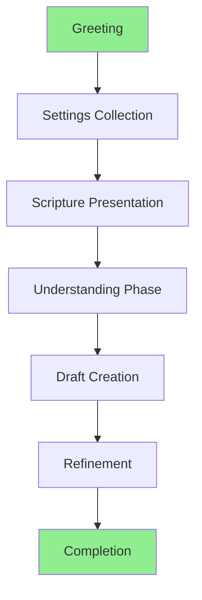
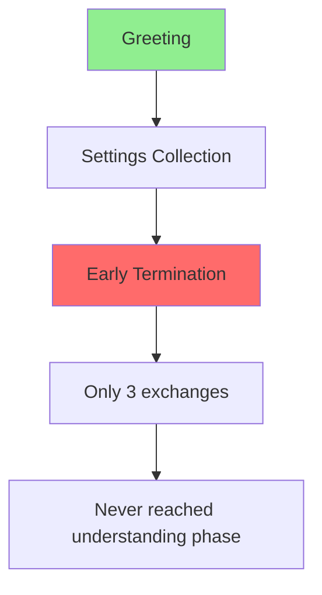
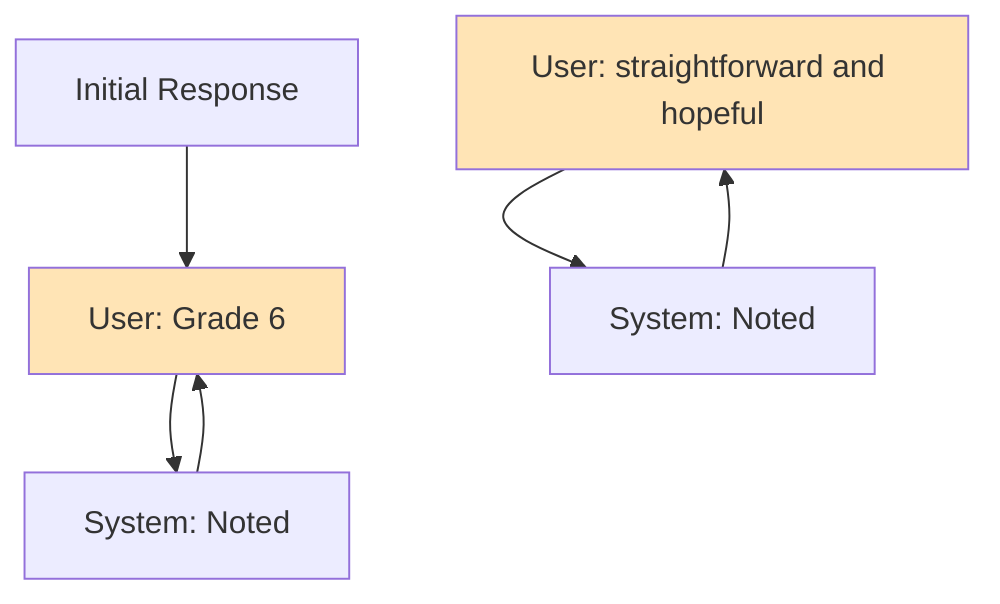

# 🔍 Bible Translation Assistant - Test Analysis Report

## Executive Summary

**Success Rate:** 6/8 personas (75%)

- ✅ **Successful:** Maria, Sarah, Pastor Amy, Ms. Chen, Reverend Thomas, Chaplain Mike
- ❌ **Failed:** John (experienced translator), Jake (youth pastor)

## Key Issues Identified

### 🔴 Critical Problems

#### 1. **Repetition Loops**

Several personas got stuck in repetition loops:

- **Ms. Chen:** Kept saying "I think Grade 4 would be appropriate" (6+ times)
- **Chaplain Mike:** Repeated "straightforward and hopeful" 10+ times
- **Reverend Thomas:** Kept saying understanding phrase but not progressing

#### 2. **Phase Confusion**

The system often thinks it's in drafting phase when it's not:

```
System: "We're in the drafting phase now"
User: [Still providing settings]
System: [Confused about current phase]
```

#### 3. **Draft Not Persisting**

Users provide complete drafts but:

- Canvas Scribe says "Noted!" but doesn't save to state
- System asks for draft again
- `Has Draft: false` in final report despite drafts provided

#### 4. **Settings Collection Chaos**

- System asks for settings already provided
- Settings recorded multiple times
- System doesn't recognize when setup is complete

## Conversation Flow Visualization

### ✅ **Successful Flow Pattern**



### ❌ **Failed Flow Pattern (John - Experienced Translator)**



### 🔄 **Repetition Loop Pattern (Chaplain Mike)**



## Detailed Problem Analysis

### Problem 1: Setting Collection Issues

**What Happens:**

```
User: "I need help with translation"
System: "What reading level?"
User: "Grade 4"
System: [Asks about drafting instead of next setting]
User: [Repeats Grade 4 thinking it wasn't heard]
```

**Root Cause:** System doesn't track conversation state properly

### Problem 2: Phase Transition Confusion

**What Happens:**

```
System: "We're in drafting phase"
User: [Still in understanding phase]
System: [Mixed signals about current phase]
```

**Root Cause:** Orchestrator and agents disagree on current phase

### Problem 3: Draft Persistence Failure

**What Happens:**

```
User: "When judges led Israel, food ran out..."  [Complete draft]
Canvas Scribe: "Noted!"
System: Has Draft: false  [Draft not saved]
```

**Root Cause:** Canvas Scribe acknowledges but doesn't update state correctly

## Pattern Recognition

### Successful Personas (What Works)

1. **Complete longer conversations** (15-20+ exchanges)
2. **Progress through phases** naturally
3. **Settings get collected** (even if messy)
4. **Provide drafts** multiple times until one sticks

### Failed Personas (What Breaks)

1. **Too efficient** - Try to skip ahead
2. **Short conversations** - End before completion
3. **Get stuck early** - Never reach drafting

## Specific Failure Modes

### Jake (Youth Pastor) - Failed at 6 exchanges

```
Problem: Conversation ended too early
- Said "high school students" twice
- System got confused about what was being answered
- Never progressed past settings collection
```

### John (Experienced Translator) - Failed at 3 exchanges

```
Problem: Ultra-efficient, system couldn't keep up
- Wanted to move fast
- System still warming up
- Ended before real work began
```

## System Behavior Patterns

### 📊 Response Distribution

| Agent                 | Response Frequency | Issues                         |
| --------------------- | ------------------ | ------------------------------ |
| Translation Assistant | High               | Sometimes confused about phase |
| Canvas Scribe         | High               | Says "Noted!" but doesn't save |
| Resource Librarian    | Medium             | Works well                     |
| Suggestion Helper     | Always             | Good suggestions               |

### 🔄 Loop Patterns

**Grade Level Loop:**

- User provides grade level
- System notes it
- System asks for something else
- User thinks grade wasn't heard
- User repeats grade level
- Loop continues...

**Tone/Approach Loop:**

- User provides tone
- System acknowledges
- System doesn't progress
- User repeats tone thinking it helps
- Loop continues...

## Recommendations

### 🛠️ Immediate Fixes Needed

1. **Fix Canvas Scribe State Saving**

   - When user provides draft, SAVE IT
   - Update `scriptureCanvas.verses['Ruth 1:1'].draft`
   - Mark phase transition properly

2. **Improve Phase Tracking**

   - Orchestrator should check actual state
   - Don't say "drafting phase" unless really there
   - Clear phase transitions

3. **Break Repetition Loops**

   - Detect when user repeats same input
   - Provide different response/progression
   - Move conversation forward

4. **Settings Collection Flow**
   - Track what's been collected
   - Ask for missing items systematically
   - Confirm when complete

### 📈 Success Metrics

**What Success Looks Like:**

- ✅ All settings collected in 5-7 exchanges
- ✅ Clear phase transitions
- ✅ Draft saved on first attempt
- ✅ No repetition loops
- ✅ 15-20 exchanges to complete translation

## Conversation Flow Recommendations

### Ideal Flow

```
1. Greeting (1 exchange)
2. Settings Collection (5-7 exchanges)
   - Language preferences
   - Reading level
   - Tone
   - Approach
3. Scripture Presentation (1 exchange)
4. Understanding (3-5 exchanges)
5. Drafting (2-3 exchanges)
6. Refinement (2-3 exchanges)
Total: 15-20 exchanges
```

### Current Reality

- Settings: 2-10+ exchanges (too variable)
- Repetition loops: 5-10 wasted exchanges
- Phase confusion: 3-5 confused exchanges
- Total: 20-30+ exchanges with frustration

## Conclusion

The system works **when conversations are long enough** and users are **patient with confusion**. The main issues are:

1. **State management** - Drafts not saving
2. **Conversation flow** - Repetition loops
3. **Phase tracking** - Confusion about current phase
4. **Efficiency** - Takes too long, too messy

The 75% success rate is deceptive - even "successful" conversations have significant issues that would frustrate real users.
